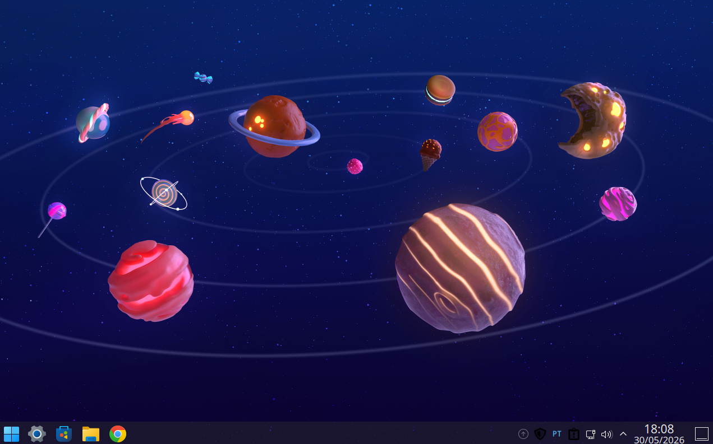
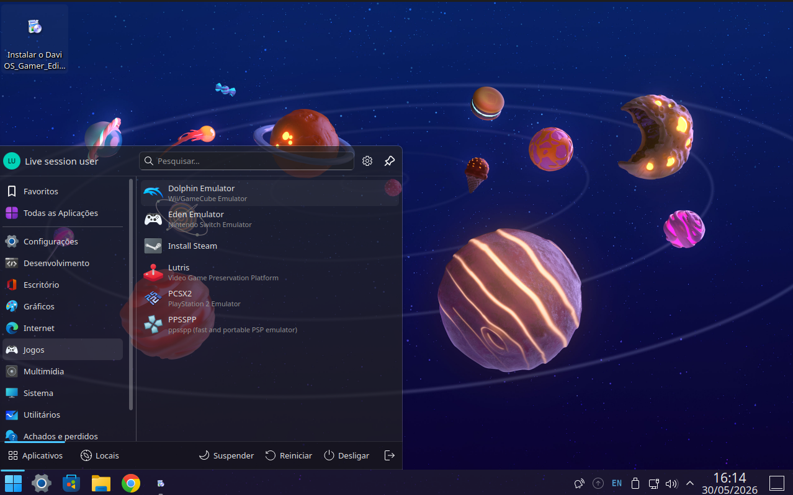
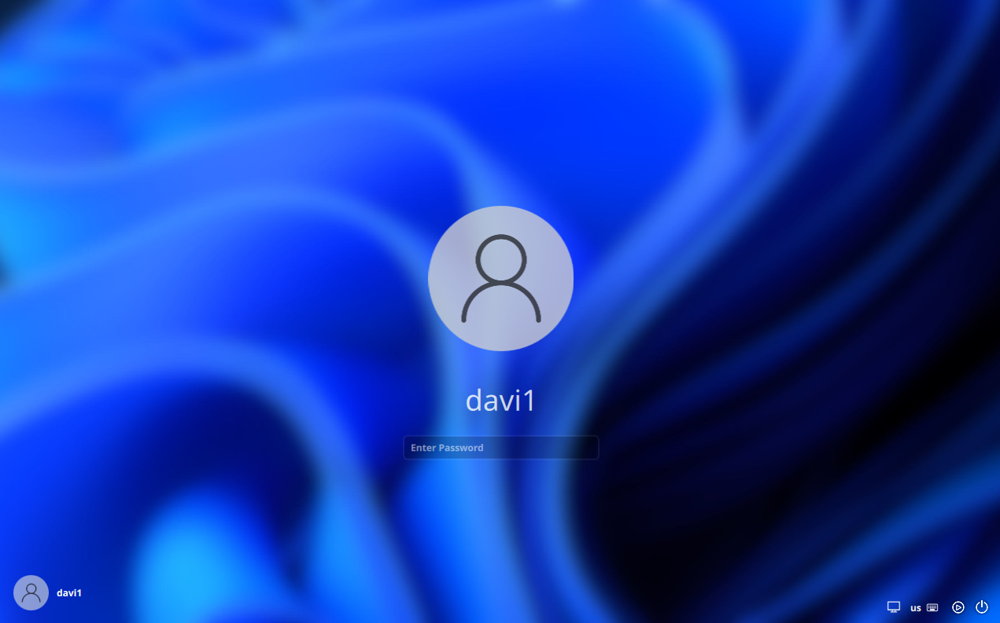
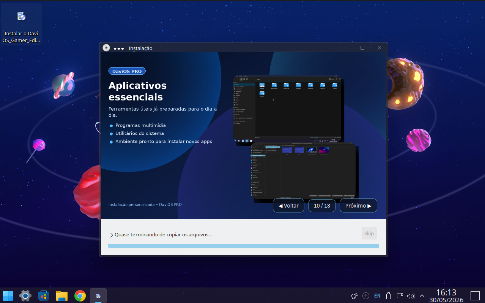
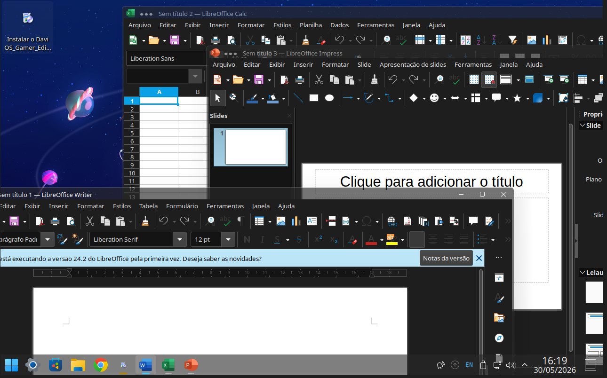
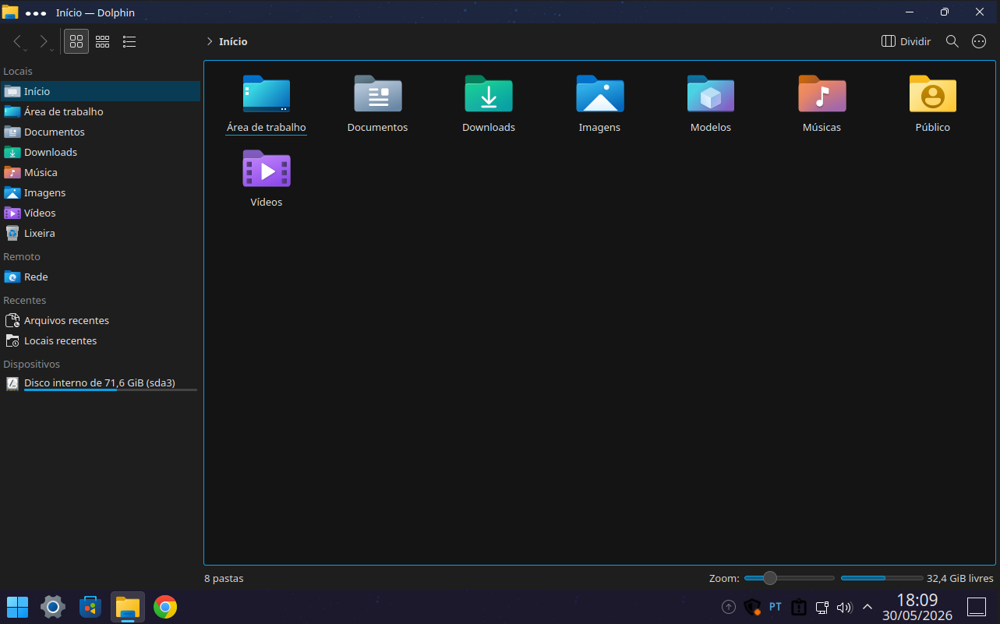

# DaviOS Gamer Edition 1.0

Uma distribuição Linux baseada em Linux Mint 22.3 e KDE Plasma, criada em homenagem ao Davi.

## Características

- KDE Plasma personalizado
- Tema inspirado no Windows 11
- IA Local integrada (Ollama + Alpaca)
- Google Chrome
- LibreOffice
- AnyDesk
- Audacity
- Emuladores:
  - PCSX2
  - Dolphin
  - PPSSPP
  - Eden Emulator

## Base do Sistema

- Linux Mint 22.3
- Ubuntu 24.04 LTS

## Objetivo

A DaviOS nasceu como um projeto familiar criado para facilitar o acesso à tecnologia, jogos, produtividade e inteligência artificial.

## Edições Futuras

- DaviOS Gamer Edition
- DaviOS PRO
- DaviOS Live
- DaviOS Kids

## Autor

Anderson Araujo

## Licença

GPL v3
## Screenshots

### Área de Trabalho

### Menu Principal

### Tela de Login

### Instalador

### IA Local

### LibreOffice

### Discover

