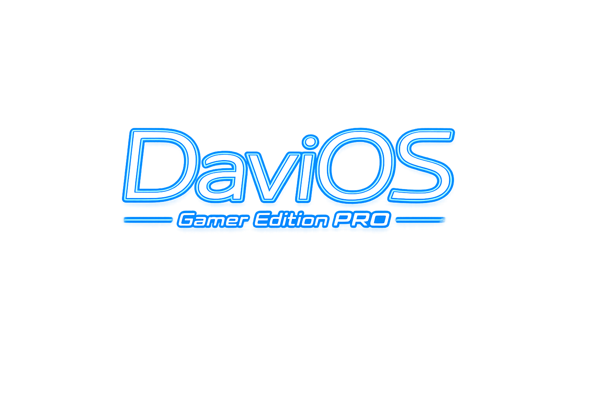
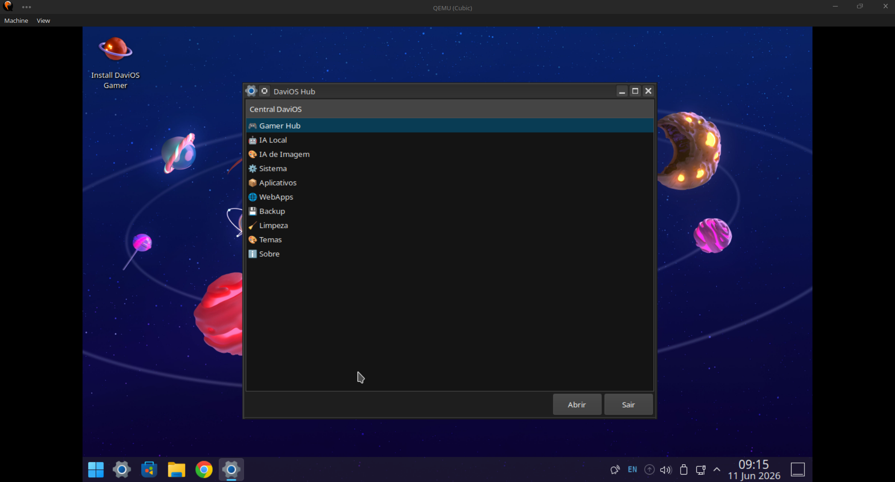
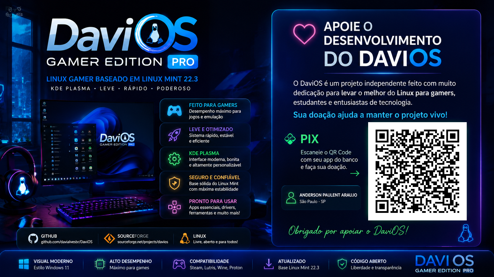

DaviOS Gamer Edition PRO 1.1

  

Uma distribuição Linux baseada em Linux Mint 22.3 e KDE Plasma, criada em homenagem ao Davi.

## Características

- KDE Plasma personalizado
- Tema inspirado no Windows 11
- IA Local integrada (Ollama + Alpaca)
- Google Chrome
- LibreOffice
- AnyDesk
- Audacity
- Emuladores:
  - PCSX2
  - Dolphin
  - PPSSPP
  - Eden Emulator

## Base do Sistema

- Linux Mint 22.3
- Ubuntu 24.04 LTS

## Objetivo

A DaviOS nasceu como um projeto familiar criado para facilitar o acesso à tecnologia, jogos, produtividade e inteligência artificial.

## Edições Futuras

- DaviOS Gamer Edition
- DaviOS PRO
- DaviOS Live
- DaviOS Kids

## Autor

Anderson Araujo

## Licença

GPL v3
## Screenshots

### Área de Trabalho

### Menu Principal

### Tela de Login

### Instalador

### IA Local

### LibreOffice

### Discover

DaviOS Gamer Edition PRO 1.2.1 RC2

DaviOS Gamer Edition é uma distribuição Linux focada em jogos, inteligência artificial local, produtividade e facilidade de uso.

Base
Linux Mint 22.3
Ubuntu Noble
KDE Plasma
Recursos
Gamer Hub
Steam
Heroic Games Launcher
Lutris
Bottles
RetroDECK
RetroArch
PCSX2
PPSSPP
Dolphin
DuckStation
FCEUX
Genesis Plus GX
IA Local
Ollama
Open WebUI

Modelos suportados:

Gemma 3 4B
Qwen 3 4B
Llama 3.2 3B

Modelos opcionais:

Gemma 3 12B
Qwen 3 8B
Llama 3.1 8B
Phi-4 Mini
Qwen Coder 7B
IA de Imagem
Stability Matrix
ComfyUI
Automatic1111
InvokeAI
WebApps
ChatGPT
GitHub
Office Online
Outlook
WhatsApp
Telegram
YouTube
Facebook
Instagram
X (Twitter)
Discord

Download
🚀Ou link direto para a V1.2.1🚀
https://sourceforge.net/projects/davios/files/1.2.1/

### Opção 2 (Espelho Google Drive)

https://drive.google.com/file/d/1luvFq-Y1IVF035rUmKFa9crOnGXrRnSz/view?usp=drive_link

SHA256:
f5e85520e82830cc2321c71024521971f3c07077de746f542d02accd6d68653e

❤️ Apoie o Projeto

